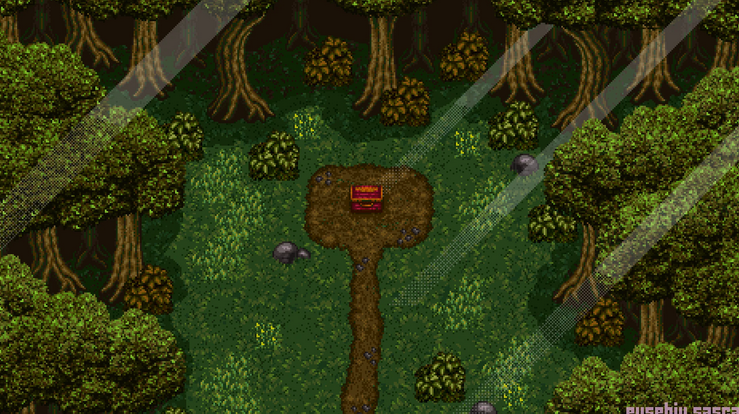
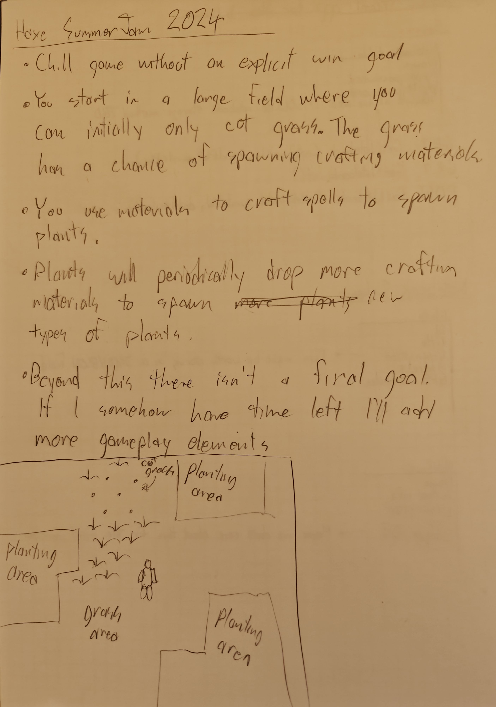
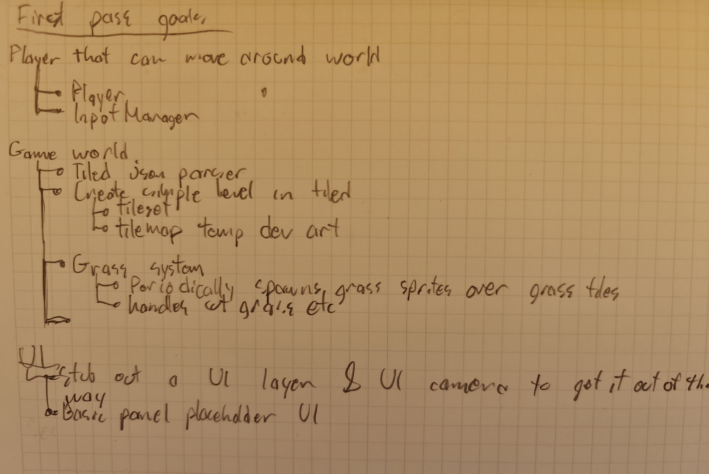

# Overview

The main point of the game is to just plant a large garden by casting plant spells. You make the spells from various materials you find cutting grass or that fall from plants.

Due to time constraints there's currently no win/lose goal. You just gradually make a larger and more varied garden.

# Planning and milestones

## Milestone 1 goal : basic moving player and world

- [DONE] Player that moves around
- [DONE] World loaded from a map in tiled
- [DONE] Grass system with cuttable grass
 - [DONE] Grass randomly emits dummy materials

## Milestone 2 goal : materials

- [DONE] Crafting material definition
- [DONE] Player can pickup crafting materials
 - [DONE] World pickup system
 - [DONE] Player inventory system for tracking what materials have been picked up
  - [DONE] UI representation of player inventory?

## Milestone 3 goal : crafting plant spells and placing plants

- [DONE] Make a UI screen for crafting things
- [DONE] Able to convert materials into placeable plants (crafting)
 - [DONE] Remember to subtract the resources from the player when crafting
  - [DONE] After crafting make sure to refresh the inventory/crafting UI's so they are correct
  - [DONE] Buttons need to say what they make
  - [DONE] Make sure we don't accidentally create a bunch of things when clicking a button for each frame
- [DONE] Object placement system
 - [DONE] Can place objects after crafting
 - [DONE] Mouse implementation

## Milestone 4 goal : refining the system & implementing plants

- Object placement system
 - Gamepad implementation?
 - Can move already placed objects
- HUD?
 - [DONE] Button on HUD to open crafting screen?
- Rough art for plants
    - [DONE] Bush 1
 - [DONE] Bush 2
 - [DONE] Bush 3
 - [DONE] Flower 1
 - [DONE] Flower 2
 - [DONE] Flower 3
 - [DONE] Tree
* Material art
 - Material 1
 - Material 2
* [DONE] After placing a plant, z-sort all the plants

## Milestone 5 goal : refining the system & implementing plants

* Art
 - Bigger tree 01
 - Bigger tree 02
 - Bigger tree 03

# Game design stuff

## Creating biomes

Maybe each patch of dirt can have certain thresholds that cause it to convert into a special environment. Special environments might have something like a blendable post processign effects and custom soundtracks. 

Take this image of chrono tigger for example. Perhaps when you hit the forest biome requirements the following happens. 

- We get animated light shafts breaking through when walking through the forst
- Perhaps we darken and add some green tinting while in the forest
- Custom forest music plays while in the forest

## Blendable environments

The idea is similar to Unreal's blendables except this system wouldn't be limited to post processing, it would affect audio, music and other subtle vfx.

 # Reference images

