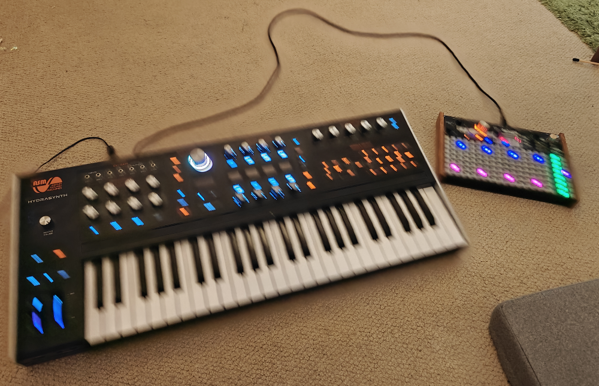

# 2024-06-16 0339

So tired, music is hard. Submitted. Will clean up UX issues etc tomorrow if I wake up before the submiision date. 

# 2024-06-16 0142

Music is in, I hate a lot about it but I'm happy with where I got. 

# 2024-06-15 1934

Got a lot of the work done that I'd hoped to get done in the scope of a jam. Also enough art that I now have to worry about crafting UI pagination.

# 2024-06-11 1554

Cutting grass now emits a default crafting material pickup which the player can "pick up" but currently nothing happens. 

Next step is to get a small system for tracking the materials the player has picked up and once that works I think I'll make a crafting beacon in the world the player can interact with to make stuff. A big reason for doing this in the world is to reduce the amount of UI work needed for crafting (I hope).

# 2024-06-11 - approx 1300

Got a basic world moving around and the ability to cut grass. I think I'm going to power ahead and have the grass emit crafting materials as soon as possible so I can get to work on the crafting part of the game.